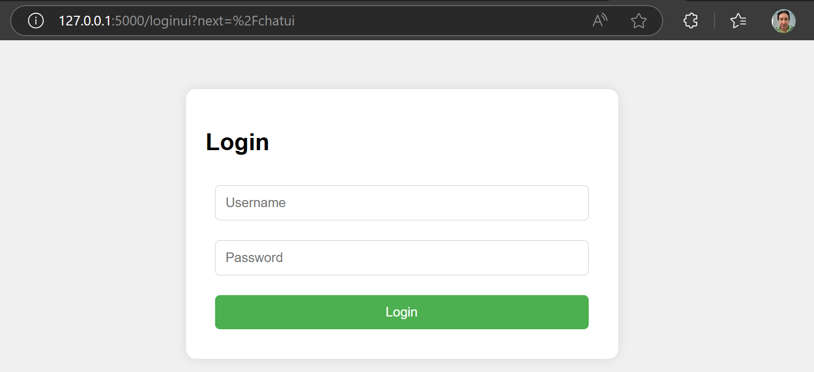

# Chatbot

This is a basic Flask project that exposes several REST API endpoints for e-commerce features, such as to retrieve order details by ID.

For a more detailed description of the features in this project, please see [the user stories](./user-stories.md)

## Endpoint

- **GET** `/orders/<id>`
  Returns the details of the order with the specified ID.

## Project Structure

```
chatbot/
├── app/
│   ├── __init__.py  # Initializes the Flask app and registers blueprints
│   └── routes.py    # Contains the /orders/ endpoint
└── run.py # Entry point to run the Flask application
README.md # Project documentation
```

## Running the Project

1. Create a virtual environment and activate it (on Windows):
   ```bash
   python -m venv venv
   Set-ExecutionPolicy Unrestricted -Scope Process
   .\\venv\\Scripts\\activate
1. Create a virtual environment and activate it (on Mac):
   ```bash
   python -m venv venv
   source venv/bin/activate
2. Install requirements:
   ```bash
   pip install -r requirements.txt
3. Run the application:
   ```bash
   python .\\chatbot\\run.py
4. If running the chat locally, run the codegemma:7b model also locally:
   ```bash
   ollama run codegemma:7b
5. Access the API at: http://127.0.0.1:5000/orders/1

### Example Response
```json
{
  "order_id": 1,
  "details": {
    "item": "Laptop",
    "quantity": 1
  }
}
```

## API

### Authentication & Session Management

Register a new user by running the following request in Postman:
```bash
   Method: POST
   URL: https://ai-chatbot-grupo66-fkgmbmedhxgqf7b6.centralus-01.azurewebsites.net/users/register
   Body: Raw / JSON
      {
         "username": "alice",
         "password": "password123"
      }
```

Login by running the following request in Postman:
```bash
   Method: POST
   URL: https://ai-chatbot-grupo66-fkgmbmedhxgqf7b6.centralus-01.azurewebsites.net/users/login
   Body: Raw / JSON
      {
         "username": "alice",
         "password": "password123"
      }
```

### Chat

Send a request to the chat by running the following request in Postman:
```bash
   Method: POST
   URL: https://ai-chatbot-grupo66-fkgmbmedhxgqf7b6.centralus-01.azurewebsites.net/chat
   Authorization:
      Type: Bearer Token
      Token: {token returned from https://ai-chatbot-grupo66-fkgmbmedhxgqf7b6.centralus-01.azurewebsites.net/users/login}
   Body: Raw / JSON
      {
         "prompt": "hello"
      }
```

## User Interface

### Authentication & Session Management

[Login page](http://127.0.0.1:5000/loginui)



Out-of-the-box credentials:
- User: admin
- Password: admin123

### Chat (user must be authenticated through the login page)

[Chat page](http://127.0.0.1:5000/chatui)


## Observability

### Health check
The application leverages the Health check feature of Azure App Services, which probes the [health](https://ai-chatbot-grupo66-fkgmbmedhxgqf7b6.centralus-01.azurewebsites.net/health) endpoint.


### Metrics (dashboard)
The application also uses a dashboard in Azure to monitor metrics for:
- Number of 2xx requests
- Health check count


### Logs
Finally, the application stores log entries for the application using this configuration:


## AI Code Generation
The code in this repository was initially generated by the following tools:
1. Microsoft 365 Copilot
2. [CodeGemma:7B](https://ollama.com/library/codegemma:7b) executed locally through [Ollama](https://ollama.com/), using the command `ollama run codegemma:7b`
3. Continue extension in Visual Studio Code

## Docker commands
These commands can be executed locally by installing [Docker Desktop](https://www.docker.com/products/docker-desktop/) or [Rancher Desktop](https://rancherdesktop.io/)

1. Build the image:
  `docker build . --tag chatbot`
2. Run the image:
  `docker run -p 5000:5000 chatbot`
3. Export docker image list of files for troubleshooting
```bash
   docker create --name tempchatbot chatbot
   docker export tempchatbot | tar -t > imagefiles.txt
   docker rm tempchatbot
